  <h1 style="font-size: 40px; font-weight: 700; color: #ba56ff;">Lígia Yumi - yumisszx</h1>

  

  🎬 creator • 💻 developer
  

  

    
  

  

    
  

### 📲 Conecte-se

    
     
    

---

### 🤖 Linguagens e Tecnologias

  

    
    
    
    
    
    
    
    
    
  

    

---

</a>

